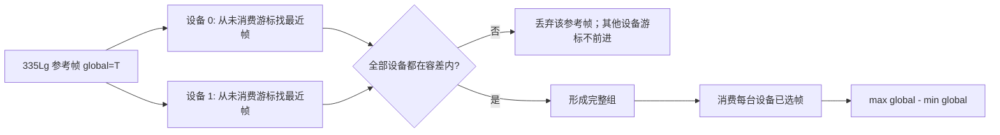

# 三相机硬件触发同步：配置、开流与全局时间戳匹配流程

本文说明本工具从同步配置、开流、采集窗口控制到时间戳匹配与精度统计的完整流程。适用于 Orbbec SDK（本项目使用 `libobsensor/ObSensor.hpp`）下的多台 Gemini 相机硬件触发场景。

> **不可变需求**
>
> 1. 多设备匹配必须优先以 **Gemini 335Lg** 为参考设备；设备名含 `335Lg` 或 `335`，或 PID 为 `2059` 时即认定为该设备。仅在没有 335Lg 时，才退回到“帧数最少的有效设备”。
> 2. 帧匹配与同步精度统计必须使用 `Frame::globalTimeStampUs()`；`timeStampUs()` 和 `systemTimeStampUs()` 仅用于诊断。
> 3. 硬件触发配置中的 `triggerOutEnable` 必须保持 `true`。
> 4. 335Lg 在当前部署中必须启用 `OB_PROP_FPS_BOOST_BOOL`，否则在 30 Hz 触发下可能只输出约一半帧率。

---

## 1. 全流程概览

```mermaid
flowchart TD
    A[main.cpp 解析 CLI 参数] --> B[DataCollector::run]
    B --> C[enumerateDevices: 枚举设备与能力]
    C --> D[configureSyncMode: 写硬件触发配置与 FPS boost]
    D --> E[resetTimestampAndSyncClock]
    E --> E1[每台设备 enableGlobalTimestamp true]
    E1 --> E2[Context::enableDeviceClockSync 0]
    E2 --> E3[等待 1 秒稳定]
    E3 --> F[collectFrames: 创建 Pipeline 与流配置]
    F --> G[依设备索引顺序 Pipeline::start]
    G --> H[打开共享 recording gate]
    H --> I[回调采集 FrameStamp]
    I --> J[冻结 gate -> stop 全部 pipeline -> 最后关闭自动触发]
    J --> K[SyncAnalyzer::run]
    K --> L[按 global timestamp 一对一匹配]
    L --> M[335Lg 锚定多设备分组]
    M --> N[max(global)-min(global) 精度统计与 CSV]
```

控制入口位于 `src/main.cpp`：先运行 `DataCollector`，可选导出原始帧 CSV，然后把帧数据与设备列表交给 `SyncAnalyzer` 输出统计报告和结果 CSV。

---

## 2. 时间戳与帧记录契约

采集数据由 `src/frame_stamp.h` 的 `FrameStamp` 保存。

| 字段 | SDK API | 时钟域/含义 | 本工具用途 |
|---|---|---|---|
| `hwTimestampUs` | `frame->timeStampUs()` | 相机设备本地硬件时钟 | 诊断、对照输出 |
| `globalTimestampUs` | `frame->globalTimeStampUs()` | SDK 换算到跨设备可比较的全局/主机时钟域 | **匹配与同步精度主指标** |
| `sysTimestampUs` | `frame->systemTimeStampUs()` | 主机侧系统时间戳 | 主机接收/回调诊断 |
| `frameNumber` | `frame->getIndex()` | SDK 帧序号 | 连续性诊断 |

`globalTimeStampUs()` 不是原始设备硬件计时；它依赖设备全局时间戳功能和时钟同步初始化。因而必须先完成第 4 节的顺序，才可以将它用于跨设备匹配。

---

## 3. 设备发现与硬件同步配置

### 3.1 枚举与能力确认

`DataCollector::enumerateDevices()` 依次执行：

```cpp
auto context = std::make_shared<ob::Context>();
auto list = context->queryDeviceList();
auto device = list->getDevice(i);
auto info = device->getDeviceInfo();
```

启动日志应记录每台设备的序号、序列号（SN）、名称、PID、VID、固件和硬件版本，并检查：

```cpp
device->getSupportedMultiDeviceSyncModeBitmap();
device->isGlobalTimestampSupported();
```

至少需要两台设备；否则同步分析没有意义。运行时的设备枚举顺序会成为 `deviceIndex`，但**不**决定多设备分析参考设备：335Lg 规则优先。

### 3.2 必须写入的同步配置

`DataCollector::configureSyncMode()` 先读取已有配置，再覆盖本任务要求的字段：

```cpp
OBMultiDeviceSyncConfig sync = device->getMultiDeviceSyncConfig();
sync.syncMode             = OB_MULTI_DEVICE_SYNC_MODE_HARDWARE_TRIGGERING;
sync.triggerOutEnable     = true;
sync.depthDelayUs         = 0;
sync.colorDelayUs         = 0;
sync.trigger2ImageDelayUs = 0;
sync.triggerOutDelayUs    = 0;
sync.framesPerTrigger     = 1;
device->setMultiDeviceSyncConfig(sync);
```

| 字段/API | 当前值 | 作用与约束 |
|---|---:|---|
| `syncMode` | `OB_MULTI_DEVICE_SYNC_MODE_HARDWARE_TRIGGERING` | 使用外部硬件触发信号。|
| `triggerOutEnable` | `true` | 必须保持开启；不得作为普通排障手段关闭。|
| `depthDelayUs` | `0` | 不额外延迟深度流。|
| `colorDelayUs` | `0` | 不额外延迟彩色流。|
| `trigger2ImageDelayUs` | `0` | 不额外设置触发到图像的延迟。|
| `triggerOutDelayUs` | `0` | 不额外延迟 trigger out。|
| `framesPerTrigger` | `1` | 每个外部触发对应一帧。|

写入后必须再次调用 `getMultiDeviceSyncConfig()` 并打印读回值；这是确认 SDK/设备实际接受配置的依据，而不是仅凭写入代码推断。

### 3.3 FPS boost

当前部署针对每台可写设备执行：

```cpp
if (device->isPropertySupported(OB_PROP_FPS_BOOST_BOOL, OB_PERMISSION_WRITE)) {
    device->setBoolProperty(OB_PROP_FPS_BOOST_BOOL, true);
    bool effective = device->getBoolProperty(OB_PROP_FPS_BOOST_BOOL);
}
```

`OB_PROP_FPS_BOOST_BOOL` 是设备属性，可能跨程序运行保留。**不调用** `setBoolProperty(..., true)` 并不表示属性会自动关闭；若做诊断实验而要强制关闭，必须显式写入 `false`，并在测试后恢复 `true`。当前已知 335Lg 在未启用时会显著降帧，因此生产/基线测试必须保持启用并查看 readback 日志。

---

## 4. 全局时间戳与设备时钟初始化

必须严格遵循以下顺序；此顺序与官方样例一致：

```cpp
for (const auto &device : devices) {
    if (device->isGlobalTimestampSupported()) {
        device->enableGlobalTimestamp(true);
    }
}
context->enableDeviceClockSync(0);
std::this_thread::sleep_for(std::chrono::seconds(1));
```

1. 对每台支持该功能的设备调用 `Device::enableGlobalTimestamp(true)`。
2. 调用 `Context::enableDeviceClockSync(0)` 同步设备时钟；`0` 为当前项目采用的 SDK 参数。
3. 等待 1 秒，让 global 时间戳转换稳定。
4. 只有完成以上步骤后才创建并启动各设备的流。

不要反转为“先 clock sync、后 enable global timestamp”，也不要删除稳定等待；这样会破坏 `globalTimeStampUs()` 的可比性。若有设备不支持全局时间戳，当前代码会输出日志并跳过 enable；这种部署不应将该设备的 global 值视作已验证的同步指标。

---

## 5. 开流、触发与正式采集窗口

### 5.1 请求流配置

`DataCollector::collectFrames()` 为每台设备创建 `ob::Pipeline` 和 `ob::Config`，按当前 `DataCollector::Config` 请求：

```cpp
streamCfg->enableVideoStream(OB_STREAM_DEPTH, width, height, fps, OB_FORMAT_Y16);
streamCfg->enableVideoStream(OB_STREAM_COLOR, width, height, fps, OB_FORMAT_YUYV);
```

代码默认值是 `1280x800 @ 30 fps`；实际协商结果应通过回调中的 `VideoFrame::getWidth()`、`getHeight()` 与 `getFormat()` 记录。`main.cpp` 帮助文字仍显示 `848x480`，因此运行时应以实际参数、配置日志和 observed profile 为准。

### 5.2 Pipeline 启动策略

当前代码按设备索引确定性地依次调用：

```cpp
pipelines_[camIndex]->start(streamCfgs[camIndex], callback);
```

此前版本使用条件变量屏障并发 start；现在的顺序启动是为了隔离“启动完成顺序是否影响残余 global 相位关系”的假设而准备的**受控实验策略**。它尚不是已证实的时序修复，不能在结论中宣称已经改善同步精度。

无论采用何种启动策略，流配置、触发生命周期、匹配算法和共享采集窗口应保持不变，保证一次测试只改变一个变量。

### 5.3 录制 gate 与自动触发

开始开流前：

```cpp
recordingEnabled_ = false;
savingEnabled_ = false;
```

因此开流过程中最早到达的回调只计入 `closedGateCallbacks`，不会写入最终 `allFrames_`、raw CSV 或图片 CSV。所有 pipeline 的 `start()` 返回后：

- 若指定 `--trigger-hz=N`，先写 `0` 关闭自动触发，然后启动 pipeline，等待约 300 ms，最后写入 `N` 启动触发；
- 自动触发且启用 color 时，代码可进行最多 2 秒、每台至少 3 帧的 color 预热；预热帧随后清空，不进入正式结果；
- 设置 `recordingArmSteadyUs_`，再同时打开 `savingEnabled_` 和 `recordingEnabled_`，建立正式共享窗口。

> gate 保证的是“回调在 arm 时刻后才被接受”，不保证被接受帧的传感器曝光一定发生在 arm 时刻后。因此必须结合首帧 `callback-after-arm`、帧序号及各时间戳观察启动残留。

### 5.4 回调采集内容

`Pipeline::start()` 的回调接收 `std::shared_ptr<ob::FrameSet>`，并通过：

```cpp
frameSet->getFrame(OB_FRAME_COLOR);
frameSet->getFrame(OB_FRAME_DEPTH);
```

分别取出 color/depth 帧。FrameSet 可能是完整的、仅深度、仅彩色，甚至为空；不能假定每个回调必定同时含两流。当前代码只统计该事实，未修改 SDK 的 FrameSet 聚合模式。

每个通过 gate 的帧记录三种时间戳、`getIndex()`，以及可用的元数据帧号：

```cpp
frame->hasMetadata(OB_FRAME_METADATA_TYPE_FRAME_NUMBER);
frame->getMetadataValue(OB_FRAME_METADATA_TYPE_FRAME_NUMBER);
```

可选的 `--outdir` 图像保存会将 color 图像转码、入后台写盘队列；慢速 `imwrite` 不在 SDK 回调线程中执行，避免因磁盘 I/O 阻塞回调。图像文件名/`timestamps.csv` 中的时间戳仍是设备时间戳，只用于图像索引，不能替代分析使用的 global 时间戳。

---

## 6. 采集诊断与安全停流

### 6.1 诊断项目

诊断只观察正式窗口，不参与匹配逻辑，也不改变 raw CSV 格式。

| 诊断 | 含义 |
|---|---|
| `callbacks closed/open` | gate 关闭/开启时收到的 FrameSet 回调数。|
| `complete/depth-only/color-only/empty` | FrameSet 内两流是否齐全。|
| `index` 与 metadata gaps | SDK 帧序号或设备元数据帧号是否跳变、倒退。|
| timestamp regressions | hw/global/system 时间戳是否倒退。|
| cadence gaps | 各时间戳和回调间隔是否大于 `1.5 × (1e6/fps)`。|
| `first/last callback-after-arm` | 回调相对正式窗口 arm 时刻的偏移。|
| observed profile | 实际收到的视频宽、高和格式。|

这些指标可区分设备源帧跳变、FrameSet 不完整与主机回调积压，但单独一项不能直接证明 global 同步异常的根因。

### 6.2 必须遵守的关闭顺序

正式窗口结束或收到 Ctrl+C 后：

1. `recordingEnabled_ = false`、`savingEnabled_ = false`，先冻结最终统计与落盘；
2. **保持触发仍在运行**，逐台调用 `Pipeline::stop()`；
3. 所有 pipeline 停止后，若本程序通过 `--trigger-hz` 管理自动触发，才写入 `0` 关闭触发；
4. 停止并 join 图片后台写盘线程，关闭图片 CSV。

不要先关闭触发再停止 pipeline。当前板端驱动环境中，先断触发可能导致收流线程等待下一帧超时，并触发驱动异常；保持触发直到流通道全部关闭是既有安全约束。

---

## 7. Global timestamp 匹配与同步精度

### 7.1 配对容差

分析器将 collector 的实际 `fps` 传入 `SyncAnalyzer::Config`，匹配容差为：

```text
matchTolUs = round(1,000,000 / fps / 2)
```

在 30 fps 下约为 `16667 us`。这只是“候选帧可组成同一时序组”的上限，**不是**同步是否异常的阈值。

### 7.2 两设备/两流配对

`matchAndDiff()` 的规则如下：

1. 每个输入流按 `globalTimestampUs` 升序排序；
2. 对 A 流的每帧，在 B 流从未消费游标起向前寻找容差内最近的 global 值；
3. 相同距离时选择较早的候选帧；
4. 匹配成功后 `bCursor = bIndex + 1`，同一 B 帧不能复用；
5. 记录 signed difference：
   ```text
   globalDiff = A.globalTimestampUs - B.globalTimestampUs
   ```
   同时输出 hw/sys 差仅作参考。



### 7.3 多设备组与 335Lg 锚定

对 depth 和 color 分别执行 `multiDeviceMatch()`：

1. 先过滤没有帧的设备；少于两台时没有结果；
2. 查找名称含 `335Lg`/`335` 或 PID `2059` 的设备；若存在且有帧，强制作为参考设备；
3. 仅当该设备不存在或无有效帧时，选择有效设备中帧数最少者；
4. 对每一帧参考帧，在所有其余设备中按 global 时间戳与未消费游标寻找最近帧；
5. 只有每台设备都有容差内候选帧才形成完整组；不完整时只消费参考帧；
6. 完整组中每个设备的已选帧都被消费，防止一帧参与多个组。

每个完整组的同步精度定义为非负极差：

```text
precisionUs = max(globalTimestampUs of group)
            - min(globalTimestampUs of group)
```

而 pairwise `globalDiff` 是带正负号的差，两者不能混淆。

### 7.4 异常判定

```text
if precisionUs >= globalThresholdUs:
    abnormalCount += 1
```

当前 CLI 参数 `--global-threshold=N` 默认是 `5000 us`。它与 `matchTolUs` 完全独立：前者评价已组成组的精度，后者决定是否允许寻找候选帧。官方脚本默认阈值可能不同，比较异常比例时必须先统一阈值、FPS、流配置与时间戳域。

---

## 8. CSV 合约

### 8.1 原始帧 CSV：`--raw-csv=PATH`

由 `DataCollector::exportRawCSV()` 导出：

```text
deviceIndex,streamType,hwTimestampUs,globalTimestampUs,sysTimestampUs,frameNumber
```

- 每行是一帧，不是已配对组；
- `globalTimestampUs` 是离线重新分析时应使用的主时间戳列；
- `hwTimestampUs`、`sysTimestampUs` 和 `frameNumber` 用于诊断、追踪跳帧和对照；
- 请保持列顺序和语义，避免破坏已有分析脚本。

### 8.2 分析结果 CSV：`--csv=PATH`

由 `SyncAnalyzer::exportCSV()` 导出：

```text
comparison_type,device_i,device_j,stream,hw_diff_us,global_diff_us,sys_diff_us,timestamp_us
```

`comparison_type` 可为 `cross_stream`、`cross_device` 或 `multi_device`。其中多设备行的 `global_diff_us` 是组内 global 极差，`hw_diff_us` 是组内 hw 极差参考值；不是有符号的两设备差。

---

## 9. 板端受控基线操作

板端项目目录为 `~/ob_time`，可执行文件为 `~/ob_time/build/timestamp_sync_check`。在项目根目录执行：

```bash
cmake --build build -j2
sudo ./build/timestamp_sync_check \
  --duration=30 --fps=30 --width=1280 --height=800 \
  --global-threshold=5000 \
  --raw-csv=raw_30s.csv --csv=sync_result_30s.csv
```

若当前目录已是 `~/ob_time/build`，可执行文件应写为 `sudo ./timestamp_sync_check`，不要再写 `./build/timestamp_sync_check`。

为检验当前“顺序开流”这个**单变量实验**，先不要附加 `--outdir` 或 `--trigger-hz`，连续运行两次并分别保存输出。每次检查：

1. 每台设备是否显示预期 SN、名称、PID 与 global timestamp support；
2. FPS boost 是否显示 `enabled requested=true`；
3. 读回的同步配置是否为 hardware triggering、`triggerOut=1`、所有延迟为 0、`framesPerTrigger=1`；
4. 日志是否先 enable global timestamp、后 device clock sync、后等待 1 秒；
5. 报告的 reference device 是否为 335Lg；
6. Depth/Color 的帧数、FrameSet 完整性、index/metadata/cadence 诊断是否异常；
7. `max(global)-min(global)`、匹配组数及 `>= 5000 us` 的异常比例是否在两次中一致改善或波动。

未完成两个以上的可比较基线前，不应把顺序开流判定为修复成功。

---

## 10. Orbbec SDK API / 常量速查表

| API/常量 | 阶段 | 作用/注意事项 |
|---|---|---|
| `ob::Context` | 初始化 | SDK 上下文；用于查询设备和同步设备时钟。|
| `Context::queryDeviceList()` | 枚举 | 获取当前设备列表。|
| `Context::enableDeviceClockSync(0)` | 时钟初始化 | 必须在所有设备已开启 global timestamp 后调用。|
| `ob::Device` | 配置 | 单台设备控制对象。|
| `Device::getDeviceInfo()` | 枚举/日志 | 读取 SN、名称、PID、固件等；335Lg 识别依据。|
| `Device::getSupportedMultiDeviceSyncModeBitmap()` | 配置前 | 输出设备支持的同步模式能力。|
| `Device::getMultiDeviceSyncConfig()` | 配置前/验证 | 读取原配置及写入后的实际配置。|
| `Device::setMultiDeviceSyncConfig()` | 配置 | 写入硬件触发参数。|
| `OB_MULTI_DEVICE_SYNC_MODE_HARDWARE_TRIGGERING` | 配置 | 硬件外触发同步模式。|
| `Device::isGlobalTimestampSupported()` | 时钟初始化 | 判断是否可以开启 global timestamp。|
| `Device::enableGlobalTimestamp(true)` | 时钟初始化 | 为 global timestamp 转换启用设备端支持。|
| `OB_PROP_FPS_BOOST_BOOL` | 配置 | 335Lg 30 Hz 触发必须启用的帧率增强属性。|
| `Device::isPropertySupported(..., OB_PERMISSION_WRITE)` | 配置 | 写 FPS boost 前确认属性可写。|
| `Device::setBoolProperty()` / `getBoolProperty()` | 配置 | 设置属性并读取验证最终状态。|
| `ob::Pipeline` | 开流 | 单设备 pipeline；`start()` 建流，`stop()` 关闭流。|
| `ob::Config` | 开流 | 用 `enableVideoStream()` 请求深度和彩色 profile。|
| `OB_STREAM_DEPTH` / `OB_STREAM_COLOR` | 开流 | 深度/彩色流类型。|
| `OB_FORMAT_Y16` / `OB_FORMAT_YUYV` | 开流 | 当前请求的深度/彩色像素格式。|
| `Pipeline::start(config, callback)` | 开流 | 启动流并注册 FrameSet 回调。|
| `FrameSet::getFrame()` | 回调 | 获取指定 color/depth 帧；允许缺失。|
| `Frame::globalTimeStampUs()` | 采集/分析 | 主匹配与精度时间戳。|
| `Frame::timeStampUs()` | 采集/诊断 | 设备硬件时间戳，仅参考。|
| `Frame::systemTimeStampUs()` | 采集/诊断 | 主机系统时间戳。|
| `Frame::getIndex()` | 采集/诊断 | SDK 帧序号。|
| `OB_FRAME_METADATA_TYPE_FRAME_NUMBER` | 采集/诊断 | 用于读取设备元数据帧号。|
| `Frame::hasMetadata()` / `getMetadataValue()` | 采集/诊断 | 安全读取帧号元数据。|
| `Frame::as<const ob::VideoFrame>()` | 回调/诊断 | 读取实际宽高、格式；彩色帧转换也依赖此类型。|

---

## 11. 排障边界与实验纪律

残余 global 精度异常尚需依靠板端受控实验验证。一次实验中不要同时改变以下多项：参考设备规则、时间戳域、延迟字段、FPS boost、流 profile、FrameSet 聚合策略、触发生命周期、SDK/固件版本或 pipeline 启动策略。

推荐顺序是：先确认配置读回和时钟初始化日志，再查看正式窗口帧数/FrameSet/序号诊断，最后比较同一参数下两次 global 统计。这样可以区分“源帧缺失或回调问题”和“global 时间轴/匹配关系问题”，避免用多个变化叠加后无法解释结果。
